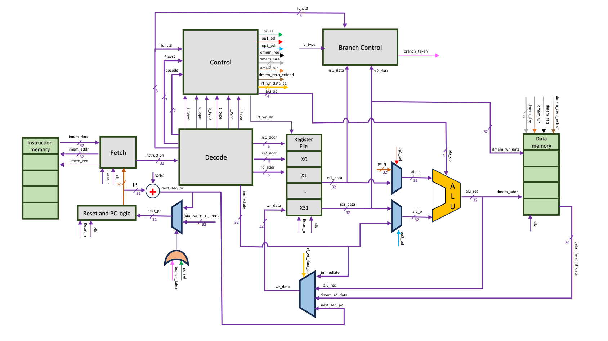
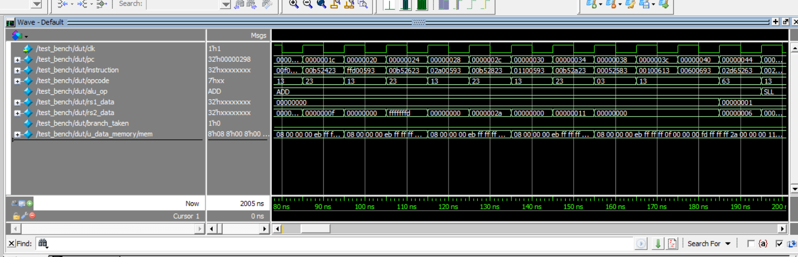

# RISCV-SystemVerilog-Core

A modular **single-cycle RV32I RISC-V processor** implemented in
**SystemVerilog**, designed with a clean RTL architecture and capable of
executing real RISC-V assembly programs. This project demonstrates the complete RTL implementation of a RISC-V processor, covering instruction fetch, decode, execution, memory access, and control.

> **Status:** Version 1.0

------------------------------------------------------------------------

# Features

-   RV32I Single-Cycle Processor
-   Modular RTL Design in SystemVerilog
-   Instruction Fetch Unit
-   Instruction Decode Unit
-   Register File
-   Arithmetic Logic Unit (ALU)
-   Immediate Generator
-   Branch Control Logic
-   Control Unit
-   Instruction Memory
-   Data Memory
-   QuestaSim Simulation
-   Support for running real RV32I assembly programs

------------------------------------------------------------------------

# Architecture

The processor follows a classic **single-cycle architecture**, where
every instruction completes in one clock cycle.

**Major Components**

-   Fetch Unit
-   Decode Unit
-   Register File
-   ALU
-   Control Unit
-   Branch Control
-   Instruction Memory
-   Data Memory

> **Architecture Diagram**
<p align="center">
  
</p>

------------------------------------------------------------------------

# Repository Structure

``` text
RISCV-SystemVerilog-Core/
│
├── rtl/                 # Synthesizable RTL modules
├── tb/                  # Testbench
├── programs/
│   ├── maximum/
│   ├── fibonacci/
│   ├── bubble_sort/
│   └── ...
├── images/
└── README.md
```

------------------------------------------------------------------------

## Demonstration Programs

The processor has been validated by executing several RV32I assembly programs that exercise arithmetic operations, memory access, branching, and control flow.

| Program | Description |
|---------|-------------|
| **Maximum Element** | Finds the maximum value in an array |
| **Fibonacci** | Generates the Fibonacci sequence |
| **Bubble Sort** | Sorts an array using the Bubble Sort algorithm |

Each program includes:

- Assembly source (`.asm`)
- Machine code (`.mem`)

------------------------------------------------------------------------
## Functional Verification

The processor was functionally verified using **QuestaSim** by executing multiple RV32I assembly programs, including **Maximum Element**, **Fibonacci**, and **Bubble Sort**. The waveform below captures a representative segment of execution, illustrating program counter progression, instruction decoding, ALU operation selection, branch decisions, and data memory activity throughout simulation.

<p align="center">
  
</p>

<p align="center">
  <em>Representative QuestaSim waveform showing processor execution and internal datapath activity.</em>
</p>

------------------------------------------------------------------------

# Getting Started

## Compile

Compile all RTL modules together with the testbench using QuestaSim/ModelSim.

## Load Program

Select one of the provided `.mem` files inside the `programs/`
directory.

## Run Simulation

Run the simulation and observe the execution through waveforms and
memory contents.


------------------------------------------------------------------------

# Future Work

-   Five-stage pipelined implementation
-   Custom ISA extensions
-   UVM-based verification environment
-   Functional coverage
-   ASIC synthesis using OpenLane
-   Timing and power optimization


